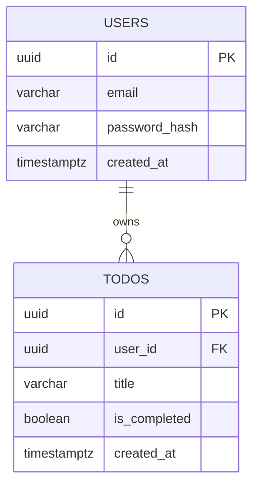

# TodoList 앱 ERD

## 1. Mermaid erDiagram 코드



## 2. 각 테이블의 역할 설명

### 2.1 `users`

이메일/비밀번호 기반 회원 정보를 저장하고, 각 Todo 데이터의 소유자를 구분하는 기준 테이블이다.

### 2.2 `todos`

사용자가 생성한 할 일 항목을 저장하며, 목록 조회, 완료 처리, 삭제의 대상이 되는 핵심 업무 테이블이다.

## 3. 각 컬럼의 타입·제약조건·역할 설명

### 3.1 `users`

| 컬럼명 | 타입 | 제약조건 | 역할 설명 |
| --- | --- | --- | --- |
| `id` | `UUID` | `PRIMARY KEY`, `NOT NULL`, `DEFAULT gen_random_uuid()` | 사용자를 고유하게 식별하는 기본 키 |
| `email` | `VARCHAR(255)` | `NOT NULL`, `CHECK (email = lower(trim(email)))` | 로그인 아이디로 사용하는 이메일 주소 |
| `password_hash` | `VARCHAR(255)` | `NOT NULL` | 평문 비밀번호 대신 저장하는 해시값 |
| `created_at` | `TIMESTAMPTZ` | `NOT NULL`, `DEFAULT now()` | 회원가입 시점을 기록 |

추가 설계 메모:
- `email`은 애플리케이션 레벨에서도 소문자/공백 정규화 후 저장하는 것을 권장한다.
- 중복 가입 방지를 위해 `UNIQUE (lower(email))` 표현식 인덱스를 사용하는 것을 권장한다.
- MVP에서는 닉네임, 프로필 이미지, 소셜 로그인 관련 컬럼은 포함하지 않는다.

### 3.2 `todos`

| 컬럼명 | 타입 | 제약조건 | 역할 설명 |
| --- | --- | --- | --- |
| `id` | `UUID` | `PRIMARY KEY`, `NOT NULL`, `DEFAULT gen_random_uuid()` | 할 일 항목을 고유하게 식별하는 기본 키 |
| `user_id` | `UUID` | `NOT NULL`, `FOREIGN KEY` → `users.id` | 이 할 일이 어떤 사용자 소유인지 나타내는 외래 키 |
| `title` | `VARCHAR(255)` | `NOT NULL`, `CHECK (char_length(trim(title)) > 0)` | 사용자가 입력하는 할 일 제목 |
| `is_completed` | `BOOLEAN` | `NOT NULL`, `DEFAULT false` | 완료 여부를 빠르게 조회하기 위한 상태값 |
| `created_at` | `TIMESTAMPTZ` | `NOT NULL`, `DEFAULT now()` | 할 일 생성 시점을 기록 |

추가 설계 메모:
- PRD 기준 MVP에는 설명, 마감일, 우선순위, 태그, 반복 일정 컬럼을 포함하지 않는다.
- PRD는 완료 시각 저장을 요구하지 않으므로 `completed_at`은 MVP ERD에서 제외한다.
- 삭제는 PRD 요구사항상 즉시 목록에서 사라지면 되므로 MVP에서는 `deleted_at` 없는 하드 삭제를 기본으로 본다.
- 기본 정렬 요구사항이 있으므로 `created_at DESC` 조회를 전제로 인덱스를 두는 것이 적절하다.

권장 인덱스:
- `users(lower(email))` 유니크 인덱스
- `todos(user_id, created_at DESC)` 복합 인덱스

제약조건 보강 이유:
- 회원가입 시 이메일 중복 방지 요구사항을 더 안전하게 만족시키기 위해 `email` 정규화 조건과 표현식 유니크 인덱스를 함께 권장한다.

## 4. 테이블 간 관계 설명

### 4.1 `users` 1 : N `todos`

한 명의 사용자는 여러 개의 할 일을 가질 수 있고, 각 할 일은 반드시 한 명의 사용자에게만 속해야 한다. 이 관계가 필요한 이유는 PRD에서 "로그인한 사용자는 자신의 할 일만 조회/삭제/완료 처리할 수 있어야 한다"는 요구가 있기 때문이다.

### 4.2 기능 요구사항과 FK 흐름의 일치성

회원가입과 로그인은 `users` 테이블만으로 처리되고, 로그인 이후의 모든 할 일 기능은 `todos.user_id`를 기준으로 소유자를 식별한다. FK 자체는 참조 무결성을 보장하고, 실제 접근 제어는 백엔드가 JWT의 사용자 ID를 조건으로 쿼리하는 방식으로 구현해야 한다.

예시 쿼리 조건:

```sql
SELECT id, title, is_completed, created_at
FROM todos
WHERE user_id = $authenticated_user_id
ORDER BY created_at DESC;

UPDATE todos
SET is_completed = $is_completed
WHERE id = $todo_id
  AND user_id = $authenticated_user_id;

DELETE FROM todos
WHERE id = $todo_id
  AND user_id = $authenticated_user_id;
```

## 5. 인증/세션 관련 설계 판단

PRD 기준 MVP에서는 별도의 `sessions` 또는 `refresh_tokens` 테이블을 ERD에 포함하지 않는다.

이 판단의 이유는 다음과 같다.

- 요구사항에 포함된 인증 기능은 회원가입, 로그인, JWT 발급, 보호된 API 접근 제어까지다.
- 백엔드 자체 JWT 인증은 액세스 토큰만으로도 최소 기능 구현이 가능하다.
- 로그아웃, 다중 기기 세션 관리, 리프레시 토큰 회전, 토큰 강제 만료 같은 요구사항은 PRD에 없다.

다만 아래 기능이 추가되면 별도 테이블이 필요해질 가능성이 높다.

- 장기 로그인 유지
- 로그아웃 후 토큰 무효화
- 다중 기기 세션 관리
- 리프레시 토큰 저장 및 회전

그 경우 후보 테이블은 `user_sessions` 또는 `refresh_tokens`가 될 수 있지만, 현재 MVP 범위에서는 과설계에 가깝다.

추가 메모:
- PRD의 "JWT 기반 인증 및 세션 유지"는 MVP 기준에서 서버 세션 저장이 아니라 클라이언트가 JWT 인증 상태를 유지하는 의미로 해석한다.
